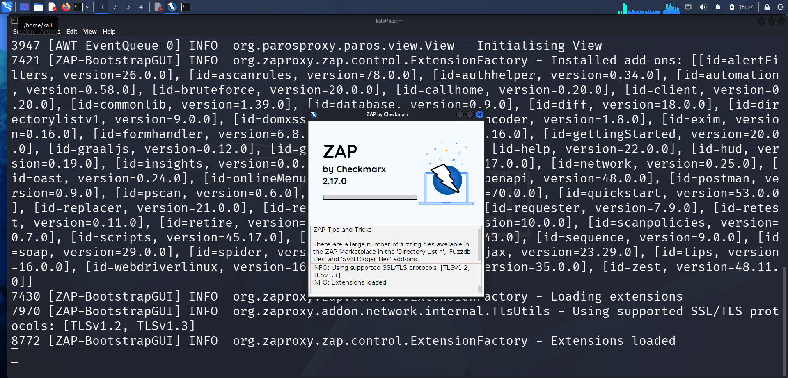
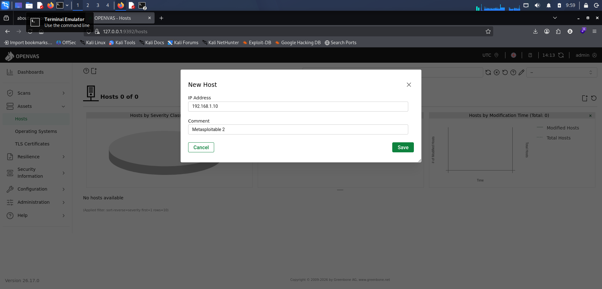
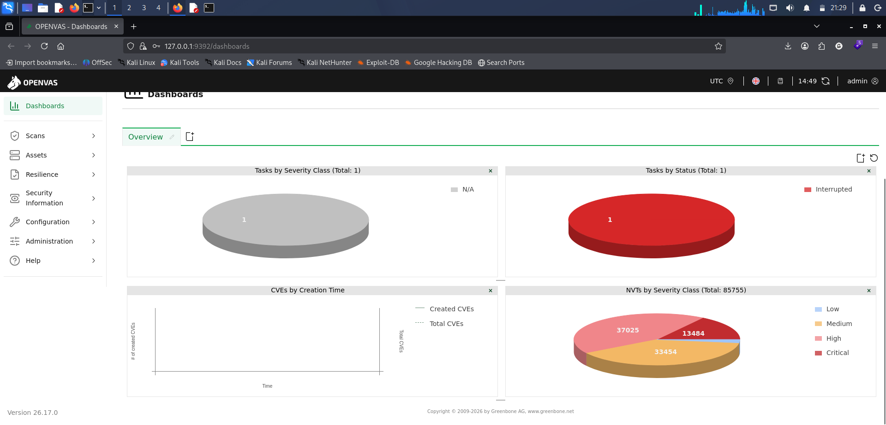

# 🔐 VAPT Home Lab — Network & Web Application Security Assessment on Metasploitable2


---

## 📌 Project Overview

This is a **complete, end-to-end Vulnerability Assessment and Penetration Testing (VAPT)** project conducted in a fully isolated home lab environment. Using four industry-standard open-source tools, the project covers every phase of a real VAPT engagement — from initial network reconnaissance through web application scanning, automated vulnerability assessment, and structured reporting.

> **Designed to demonstrate practical, job-ready skills in VAPT and SOC operations** — including network enumeration, web application security testing, vulnerability identification, CVE mapping, and professional documentation.

---

## 🧪 Lab Environment

| Component | Details |
|---|---|
| **Hypervisor** | Oracle VirtualBox |
| **Attacker Machine** | Kali Linux (Rolling Release) |
| **Target Machine** | Metasploitable2 — intentionally vulnerable Linux VM |
| **Network Mode** | Host-Only Adapter (fully isolated — no internet exposure) |
| **Target IP** | 192.168.1.10 / 192.168.1.7 |
| **Lab Type** | Completely offline, self-contained environment |

### Network Topology

```
┌─────────────────────────────────────────────┐
│           VirtualBox Host-Only Network      │
│                                             │
│   ┌──────────────────┐  ┌────────────────┐  │
│   │   Kali Linux     │  │ Metasploitable2│  │
│   │   (Attacker)     │◄-►│   (Target)    │  │
│   │   192.168.x.x    │  │ 192.168.1.10   │  │
│   └──────────────────┘  └────────────────┘  │
│                                             │
│        ⚠️  Isolated — No Internet Access    │
└─────────────────────────────────────────────┘
```

---

## 🛠️ Tools Used

| # | Tool | Version | Purpose |
|---|---|---|---|
| 1 | **Nmap** | 7.98 | Network discovery, port scanning, service/version enumeration |
| 2 | **Nikto** | 2.6.0 | Web server misconfiguration & known CVE detection |
| 3 | **OWASP ZAP** | 2.17.0 | Web application spidering, active scanning, alert analysis |
| 4 | **OpenVAS / GVM** | 25.04.3 | Full network vulnerability assessment (85,755 NVTs) |

---

## 🎯 Project Objectives

- [x] Build a fully isolated VAPT lab using VirtualBox (Host-Only networking)
- [x] Confirm target machine connectivity and identify IP address
- [x] Perform network-level reconnaissance and service enumeration with **Nmap**
- [x] Identify web server misconfigurations and outdated software with **Nikto**
- [x] Spider web applications and analyze security alerts with **OWASP ZAP**
- [x] Install, configure, and operate **OpenVAS/GVM** for comprehensive vulnerability assessment
- [x] Generate professional reports from Nikto and ZAP
- [x] Map findings to CVEs and assess risk using severity classification

---

## 🔬 VAPT Methodology

```
PHASE 1 — RECONNAISSANCE
   └── Confirm target IP on Metasploitable2 terminal
   └── Basic Nmap scan: discover all open ports

PHASE 2 — SERVICE ENUMERATION
   └── Nmap -sV: identify exact versions of every running service
   └── Map outdated/vulnerable versions to known CVEs

PHASE 3 — WEB SERVER SCANNING
   └── Nikto: scan Apache web server on port 80
   └── Identify: version disclosure, missing headers, exposed directories
   └── Export: professional HTML report (8242 requests, 30 findings)

PHASE 4 — WEB APPLICATION SCANNING
   └── OWASP ZAP: launch and configure automated scan
   └── Spider: crawl entire web app (657 URLs found)
   └── Spider /dvwa and /phpMyAdmin separately
   └── Analyze: 25 alerts including CSRF, CSP, Hash Disclosure, Directory Browsing
   └── Export: ZAP HTML report with full alert details

PHASE 5 — VULNERABILITY ASSESSMENT
   └── Install OpenVAS/GVM on Kali Linux
   └── Sync NVT feed: 85,755 vulnerability tests loaded
   └── Add Metasploitable2 as scan target
   └── Configure task: Full and Fast scan profile
   └── Execute scan and review results

PHASE 6 — ANALYSIS & DOCUMENTATION
   └── Consolidate findings across all 4 tools
   └── Map to CVEs, apply severity ratings
   └── Document remediation recommendations
```

---

## 📋 Detailed Walkthrough

---

### 🔵 PHASE 1 & 2 — Nmap: Network Reconnaissance & Service Enumeration

#### Step 1 — Confirming the Target IP

The target's IP was confirmed directly on Metasploitable2 using `ip a`.

**Target IP: `192.168.1.10`**


*Metasploitable2 terminal output — eth0 assigned IP 192.168.1.10, confirmed reachable from Kali Linux.*

---

#### Step 2 — Nmap Basic Port Scan

```bash
sudo nmap 192.168.1.10
```

Result: **20+ open ports** discovered — FTP (21), SSH (22), Telnet (23), HTTP (80), SMB (139/445), MySQL (3306), and more.


*Nmap basic scan — 977 closed ports filtered, 20+ open ports revealed. Every open port is a potential entry point.*

---

#### Step 3 — Nmap Service Version Detection

```bash
sudo nmap 192.168.1.10 -sV
```

Exact software versions identified. Several are immediately critical with known backdoors and RCE vulnerabilities.


*Nmap -sV scan part 1 — vsftpd 2.3.4 (backdoored, CVE-2011-2523), Apache 2.2.8, OpenSSH 4.7p1, Samba 3.X (RCE), ProFTPD 1.3.1.*


*Nmap -sV scan part 2 — UnrealIRCd (backdoor, CVE-2010-2075), Apache Tomcat 1.1, MySQL 5.0.51a, PostgreSQL 8.3.0, VNC. Scan completed in 23.39 seconds.*

---

### 🟡 PHASE 3 — Nikto: Web Server Vulnerability Scanning

Target: `http://192.168.1.7:80` (Apache 2.2.8 on Metasploitable2)

#### Step 4 — Nikto Initial Scan

```bash
nikto -h http://192.168.1.7
```

Nikto immediately identified the web server version, PHP version exposure, directory indexing, and multiple missing security headers.


*Nikto v2.6.0 scan — Apache/2.2.8 (Ubuntu), PHP/5.2.4 version disclosed, /icons/ directory indexing enabled, mod_negotiation MultiViews (brute-force risk), missing Referrer-Policy and Permissions-Policy headers.*

---

#### Step 5 — Saving Nikto Output as HTML Report

```bash
nikto -h http://192.168.1.7 -o nikto_report.html -Format htm
```

The report was saved as a structured HTML file for professional documentation.


*Nikto scan with `-o nikto_report.html -Format htm` flag — saving all 30 findings to an HTML report. Scan ran 460 seconds, sent 8242 requests.*

---

#### Step 6 — Nikto HTML Report (in Firefox)

The generated HTML report was opened in Firefox for review and documentation.


*Nikto HTML report — Target: 192.168.1.7:80 / Apache 2.2.8. Findings: PHP 5.2.4 version exposed, /icons/ directory indexing, Apache mod_negotiation MultiViews enabled (filename brute-force risk), missing security headers.*


*Nikto HTML report continued — phpMyAdmin README publicly exposed, X-Frame-Options header deprecated/missing, X-Content-Type-Options header not set. Scan summary: 8242 requests, 16 errors, 30 findings in 460 seconds.*

**Key Nikto Findings Summary:**

| Finding | Risk | Detail |
|---|---|---|
| PHP 5.2.4 version disclosed | Medium | Current is 8.5.1 — severely outdated |
| Apache 2.2.8 version disclosed | Medium | Current is 2.4.66 — severely outdated |
| /icons/ directory indexing | Medium | Directory contents publicly browsable |
| phpMyAdmin README exposed | Medium | Reveals database admin panel existence |
| mod_negotiation MultiViews | Medium | Enables filename brute-forcing |
| Missing X-Frame-Options | Low | Clickjacking risk |
| Missing X-Content-Type-Options | Low | MIME-type sniffing risk |
| Missing security headers (3x) | Low | Strict-Transport-Security, Referrer-Policy, Permissions-Policy |

---

### 🔴 PHASE 4 — OWASP ZAP: Web Application Security Testing

#### Step 7 — Launching OWASP ZAP

ZAP 2.17.0 by Checkmarx was launched from the terminal. The application loaded all installed add-ons including ascanrules, spider, bruteforce, formhandler, and 40+ additional modules.


*OWASP ZAP 2.17.0 startup — loading 40+ add-ons including ascanrules v78.0.0, spider v16, bruteforce v20.0.0, domxss, formhandler v6.8, and more. SSL/TLS protocols TLSv1.2 and TLSv1.3 confirmed.*

---

#### Step 8 — ZAP Session Configuration

On first launch, ZAP prompts whether to persist the session. A new temporary session was started for this engagement.


*ZAP session persistence dialog — "No, I do not want to persist this session" selected. New root CA certificate created for intercepting HTTPS traffic.*

---

#### Step 9 — Configuring the Automated Scan

ZAP Automated Scan was configured with the target URL. Traditional spider and AJAX spider with Firefox were enabled.


*ZAP Automated Scan — target set to http://192.168.1.7. Traditional spider enabled, AJAX spider configured with Firefox. Attack button ready.*

---

#### Step 10 — Spider Crawl (Full Site)

The spider discovered 657 URLs across the entire Metasploitable2 web application, mapping the complete attack surface.


*ZAP spider at 33% progress — 657 URLs found, 74 nodes added. GET and POST requests captured across multiple web apps including TWiki. Out-of-scope external links flagged automatically.*

---

#### Step 11 — Targeted Spider: DVWA

A targeted spider was run specifically against the DVWA (Damn Vulnerable Web Application).


*ZAP spider on /dvwa — 100% complete. Discovered: dvwa/login.php, dvwa/css/login.css, dvwa images, robots.txt, sitemap.xml. Login form (POST to login.php) captured for further testing.*

---

#### Step 12 — Targeted Spider: phpMyAdmin

A separate spider was run against phpMyAdmin to map the database management interface.


*ZAP spider on /phpMyAdmin — 18 URLs found including POST requests to index.php, CSS resources, and favicon. phpMyAdmin panel fully mapped and exposed without authentication.*

---

#### Step 13 — ZAP Insights & Performance Analysis

The Insights tab revealed high memory usage (99%) and important scan statistics about the target.


*ZAP Insights — High: memory at 99%, 84% of responses returned 200 OK (large attack surface), 10% 3xx redirects, 4% 4xx errors, 1% network failures. 643 ZAP warnings logged.*

---

#### Step 14 — ZAP Alerts: Detailed Finding Analysis

ZAP identified **25 alerts** across the web application. The Alerts panel shows findings with full HTTP context.


*ZAP alert detail — Hash Disclosure MD5 Crypt (Risk: High, Confidence: High). MD5 hash found in HTTP response from /mutillidae/index.php. Evidence: `$1$19256372$KHzgGBLSYvURv2PfLiOST1`. CWE ID: 497. OWASP mapped.*


*ZAP Alerts panel — 25 total alerts. Includes: Hash Disclosure MD5 (High), CSRF missing (Systemic), CSP Header Not Set (Systemic), Directory Browsing (Systemic), Missing Anti-clickjacking Header, Vulnerable JS Library, Private IP Disclosure (35 instances), Auth Requests Identified (8), Info Disclosure in URL — tagged to OWASP_2017_A03 (Sensitive Data Exposure).*

**ZAP Alerts Summary:**

| Severity | Alert | Instances |
|---|---|---|
| 🔴 High | Hash Disclosure — MD5 Crypt | 3 |
| 🟠 Medium | Absence of Anti-CSRF Tokens | Systemic |
| 🟠 Medium | Content Security Policy (CSP) Not Set | Systemic |
| 🟠 Medium | Application Error Disclosure | 311 |
| 🟡 Low | Missing Anti-clickjacking Header | Systemic |
| 🟡 Low | Cookie No HttpOnly Flag | Systemic |
| 🟡 Low | Cookie without SameSite Attribute | Systemic |
| 🟡 Low | Directory Browsing | Systemic |
| 🟡 Low | Private IP Disclosure | 35 |
| 🟡 Low | Vulnerable JS Library | — |
| ℹ️ Info | Server Leaks Version via "Server" Header | — |
| ℹ️ Info | Information Disclosure — Sensitive Info in URL | — |
| ℹ️ Info | Auth Request Identified | 8 |

---

#### Step 15 — ZAP HTML Report Generated

A full HTML report was exported from ZAP and opened in Firefox for documentation.


*ZAP HTML report — generated Thu 25 Jun 2026 at 17:20:08 using ZAP 2.17.0 by Checkmarx. Report contains: Alert Counts by Risk, Alert Counts by Site, Alert Counts by Alert Type, Insights, and full Alerts section.*

---

### 🟢 PHASE 5 — OpenVAS / GVM: Full Vulnerability Assessment

#### Step 16 — Installing OpenVAS/GVM

```bash
sudo apt install gvm -y
```

GVM (Greenbone Vulnerability Manager) was installed from the Kali Linux repositories.


*GVM installation — packages: greenbone-security-assistant 26.17.0, gsad 24.16.0, gvm 25.04.3, gvm-tools 25.4.6, libmicrohttpd. Download: 3,540 kB.*

---

#### Step 17 — Starting OpenVAS Services

```bash
sudo gvm-start
```

The GSAD daemon started successfully, serving the web UI at `https://127.0.0.1:9392`.


*`gvm-start` output — gsad.service confirmed active (running) since 2026-06-21 08:44:49. HTTPS server started on 127.0.0.1:9392. Main PID: 70489.*

---

#### Step 18 — OpenVAS Web UI Login

The Greenbone Security Assistant (GSAD) web interface was accessed via browser.


*OpenVAS Community Edition login page at https://127.0.0.1:9392 — professional web-based vulnerability management interface.*

---

#### Step 19 — Dashboard: NVT Feed Verified

After login, the dashboard confirmed the NVT (Network Vulnerability Tests) feed was fully synchronized — **85,755 vulnerability checks** available.


*OpenVAS dashboard — NVTs by Severity Class (Total: 85,755). Feed sync confirmed successful. Scanner ready for assessment.*


*NVT breakdown — Critical: 13,484 | High: 37,025 | Medium: 33,454 | Low: minimal. 85,755 total vulnerability checks loaded.*

---

#### Step 20 — Adding the Target

Metasploitable2 was registered as a scan target via Assets → Hosts → New Host.


*OpenVAS "New Host" dialog — IP Address: 192.168.1.10, Comment: Metasploitable 2. Target registered for scanning.*

---

#### Step 21 — Scan Task Configuration & Execution

A scan task was created and configured with the Full and Fast profile.

| Setting | Value |
|---|---|
| Target | Metasploitable2 — 192.168.1.10 |
| Scanner | OpenVAS Default |
| Scan Config | Full and fast |
| Max NVTs per host | 4 |
| Max concurrent hosts | 20 |


*OpenVAS Tasks view — "Metasploitable2" task created, Status: New. Ready to launch.*


*Task configuration details — Full and fast scan config, OpenVAS Default scanner, assets logging enabled.*


*OpenVAS dashboard during scan session — task tracked through the dashboard. NVT feed with 85,755 checks active throughout the assessment.*

---

## 📊 Consolidated Findings — All 4 Tools

| Severity | Finding | Tool | CVE / Reference |
|---|---|---|---|
| 🔴 **Critical** | vsftpd 2.3.4 Backdoor | Nmap + OpenVAS | CVE-2011-2523 |
| 🔴 **Critical** | Samba Username Map Script RCE | Nmap + OpenVAS | CVE-2007-2447 |
| 🔴 **Critical** | UnrealIRCd Backdoor | Nmap + OpenVAS | CVE-2010-2075 |
| 🔴 **High** | Hash Disclosure — MD5 Crypt | OWASP ZAP | CWE-497 |
| 🟠 **High** | Apache Tomcat Default Credentials | Nmap + OpenVAS | — |
| 🟠 **High** | MySQL No Root Password | Nmap + OpenVAS | — |
| 🟠 **High** | Apache httpd 2.2.8 — Multiple CVEs | Nikto + Nmap | Various |
| 🟠 **Medium** | phpMyAdmin Exposed (No Auth) | Nikto + ZAP | — |
| 🟠 **Medium** | CSRF Protection Missing (Systemic) | OWASP ZAP | OWASP A05 |
| 🟠 **Medium** | CSP Header Not Set (Systemic) | OWASP ZAP | OWASP A05 |
| 🟠 **Medium** | Application Error Disclosure (311) | OWASP ZAP | OWASP A05 |
| 🟠 **Medium** | PHP 5.2.4 Version Disclosed | Nikto | — |
| 🟡 **Medium** | Directory Indexing (/icons/, /dvwa) | Nikto + ZAP | — |
| 🟡 **Low** | Cookie Security Flags Missing | OWASP ZAP | OWASP A02 |
| 🟡 **Low** | Private IP Disclosure (35 instances) | OWASP ZAP | — |
| 🟡 **Low** | Telnet Cleartext Protocol | Nmap | — |
| 🟡 **Low** | Multiple Missing Security Headers | Nikto + ZAP | — |
| ℹ️ **Info** | Server/Version Headers Leaking | Nikto + ZAP | — |

---

## 💡 Key Learnings

**Technical skills developed through this project:**

- Setting up a professional isolated VAPT lab on VirtualBox with Host-Only networking
- Executing multi-stage Nmap scans: discovery → service enumeration → version detection
- Using Nikto to identify web server misconfigurations and generating structured HTML reports
- Operating OWASP ZAP in Attack Mode — spider crawling, active scanning, and alert analysis across DVWA and phpMyAdmin
- Installing, configuring, and running OpenVAS/GVM including NVT feed synchronization and scan task management
- Understanding the difference between network-layer vulnerability assessment (OpenVAS) and web application scanning (ZAP/Nikto)
- Mapping discovered vulnerabilities to CVEs and OWASP categories, and assessing severity using CVSS ratings
- Generating and interpreting professional security reports from multiple tools

**Analytical skills developed:**

- Reading and interpreting tool outputs to identify what matters and why
- Understanding why vsftpd 2.3.4, UnrealIRCd, and Samba 3.X are immediately critical
- Recognizing the real-world risk of exposed phpMyAdmin panels, missing CSRF tokens, and hash disclosures
- Correlating findings across multiple tools to build a complete picture of the attack surface
- Structuring a complete VAPT engagement — the same workflow used in professional SOC and red team environments

---

## ⚠️ Disclaimer

> This project was conducted **entirely within a personal, isolated home lab environment** for **educational purposes only**. All tools were used exclusively against **Metasploitable2**, a virtual machine created specifically for security training and research. No real systems, production networks, third-party infrastructure, or external assets were scanned or targeted at any point. Unauthorized scanning or penetration testing of any system without explicit written permission is illegal under the IT Act 2000 (India), CFAA (US), and equivalent laws worldwide.

---

## 👩‍💻 About Me

I'm an aspiring **SOC Analyst and VAPT Analyst** actively building hands-on skills through home lab projects, certifications, and practical simulations.

- 🎓 Cybersecurity Certification — Completed
- 🏢 6-Month Internship — Network & Packet Analysis, IDS/Firewall, VAPT, Web Application Security, SOC Operations, Python/Bash Scripting
- 🔭 Currently exploring: Threat Hunting, SIEM tools (IBM QRadar, Wazuh), Digital Forensics, BTL1 Certification
- 🛠️ Tools: Kali Linux · Nmap · Nikto · OWASP ZAP · OpenVAS/GVM · Wireshark · IBM QRadar · Autopsy · Metasploit
- 📍 Based in Hyderabad, India | Open to SOC Analyst / VAPT Analyst roles

[](https://www.linkedin.com/in/malathi-mittapalli-enola-b73208413)
[](https://github.com/malathi-cyber-sketch)

---

## 📁 Repository Structure

```
vapt-home-lab-metasploitable2/
│
├── README.md                               ← Full project documentation (you are here)
│
├── screenshots/                            ← All 27 lab screenshots
│   │
│   │   ── Nmap ──
│   ├── meta_2_ip.png
│   ├── nmap_scan_on_target.png
│   ├── nmap_version.png
│   ├── nmap_version_2.png
│   │
│   │   ── Nikto ──
│   ├── nikto_1.png
│   ├── save_output.png
│   ├── firefox_nikto.png
│   ├── nikto_4.png
│   │
│   │   ── OWASP ZAP ──
│   ├── zaproxy.png
│   ├── z_2nd.png
│   ├── zap_3.png
│   ├── 4th_z.png
│   ├── zap_dvwa.png
│   ├── zap_php.png
│   ├── zap_5.png
│   ├── zap_6.png
│   ├── zap_alerts.png
│   ├── report_zap.png
│   │
│   │   ── OpenVAS ──
│   ├── first_screenshot_open_downloading.png
│   ├── 2nd_open_vas_start.png
│   ├── open_VAS_web_page.png
│   ├── open_vas_running.png
│   ├── result_today.png
│   ├── added_target.png
│   ├── success_added_target.png
│   ├── target.png
│   └── result.png
│
└── report/
    └── VAPT-Final-Report.md                ← Detailed findings & remediation write-up
```

---

*⭐ If this project helped you set up your own VAPT lab, feel free to star the repo and share!*
